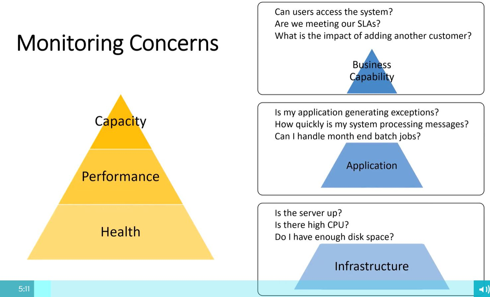
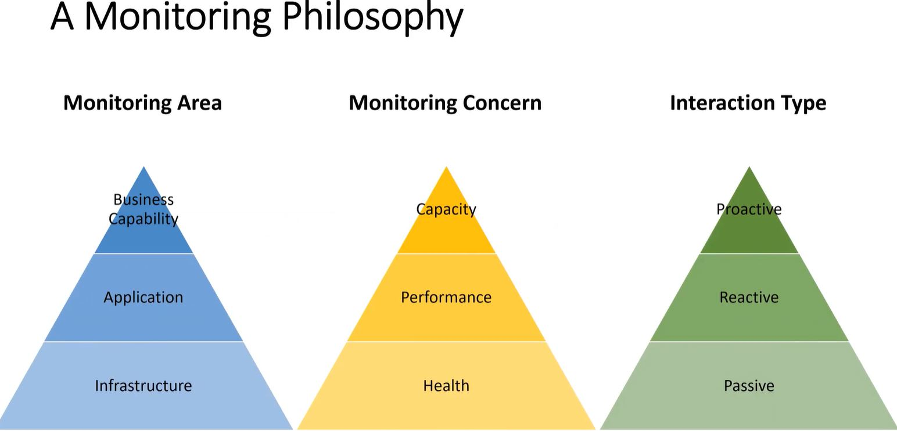

# Microservices - FAQ

- Where to put shared code such as DDD concepts (Aggregates, Entities, ValueObjects) to be consumed by different microservices?
  - Create a nuget package for it and put it in private nuget server.
- Where to put shared/common code such as utility?
  - Consider it as a third-party library with its own repo and nuget packages. It can be versioned independently. It need not be on production environment as its a library
- How to ensure Aotmicity for larger business transactions spanning multiple microservices?
  - SAGA with compensating commands
- How to implement security in a microservice?
  - OAUTH, JWT
  - No sharing of credentials with other services
- How to monitor microservices?
  - Azure App Insights
  - 
  - 
  - 

## References

- [How to avoid microservices pitfalls](https://fast.wistia.net/embed/iframe/uzklqfu5he?autoPlay=true)
- [NServiceBus-What to consider when monitoring microservices](https://fast.wistia.net/embed/iframe/6a87g49c9y?autoPlay=true)